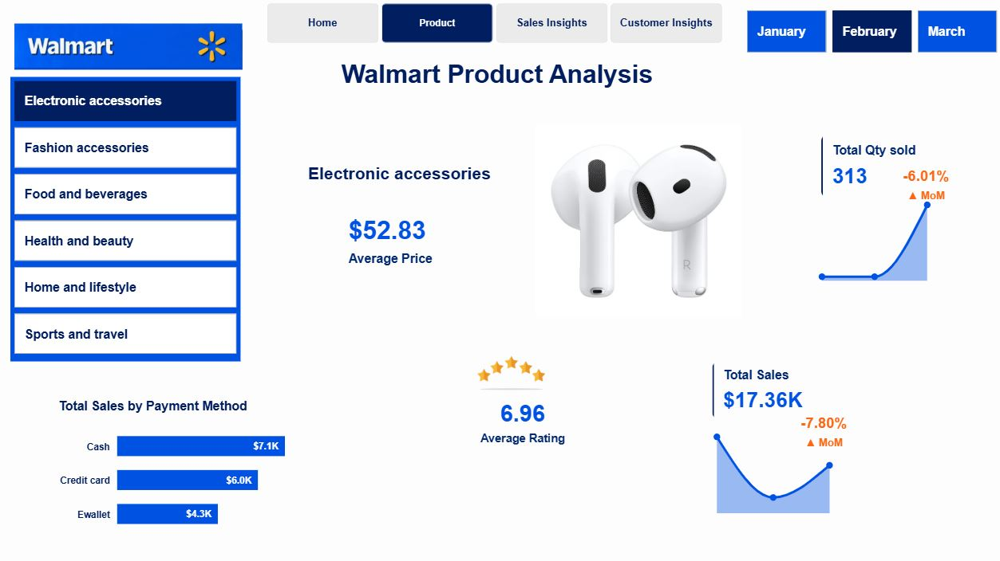
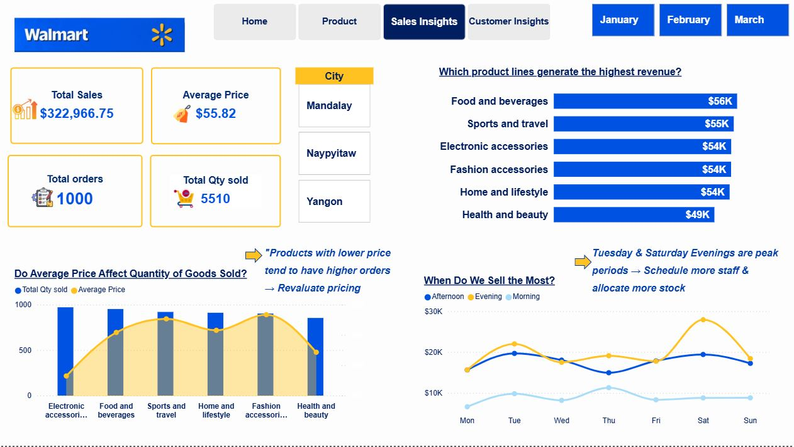
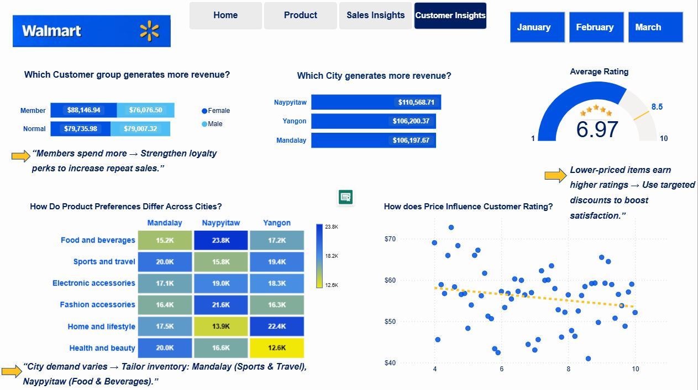

# Walmart Sales Analytics

## Business Problem
Retail businesses operate in a fast-paced and highly competitive environment where growth and profitability depend on understanding **what drives sales, when demand peaks, and which customers and products create the most value**.  
Without effective analysis of large transaction datasets, organizations struggle to optimize pricing, inventory allocation, staffing, and product strategy, leading to missed revenue opportunities and operational inefficiencies.

## Objective
- Convert Walmart retail transaction data into actionable business insights  
- Identify sales drivers, demand patterns, and customer preferences  
- Support strategic decisions around pricing, inventory, staffing, and product optimization  

**Key Business Question**
- *How is the retail business performing and where do we have opportunities to drive revenue growth, customer loyalty, and operational excellence?*

## Dataset
- **Source:** [Kaggle: Walmart Commerce Data](https://www.kaggle.com/datasets/antaesterlin/walmart-commerce-data/data)
- **Coverage:** Walmart retail transactions (Myanmar)
- **Time Period:** 3 months
- **Key Fields:**
  - Invoice ID
  - Branch / City
  - Product line
  - Unit price and quantity
  - Total sales
  - Payment method
  - Date and time
  - Customer type and gender

## Tools Used
- Power BI  
  - Power Query  
  - DAX  
  - Custom visuals  
  - Image lookup tables  
  - UI-focused dashboard design  

## Analysis Approach

### Data Preparation
- Data cleaning and transformation using Power Query
- Creation of a structured data model
- Development of supporting lookup tables (including image tables)

### Exploratory & Diagnostic Analysis
- Sales performance trends over time
- Product line and category analysis
- Branch-level performance comparison
- Customer purchasing behavior and payment preferences

### Metrics & Calculations
- Total Sales and Quantity Sold
- Month-over-Month (MoM) sales growth and variance
- Demand patterns by day of week and time of day
- Product and city contribution analysis

### Visualization & Storytelling
- 3-page Power BI dashboard with a business storytelling flow
- Clear separation of product, Sales, and customer insights
- UI design inspired by modern retail dashboards

## Key Insights
- **$322K total sales** generated over **3 months**, with **5,510 items sold**.
- **Electronic Accessories** show strong sales volume but experienced a **-6.01% MoM decline** in February.
- **Cash** remains the most preferred payment method among customers.

 

- **Food & Beverages** lead overall product demand.
- **Tuesday and Saturday evenings** represent peak sales periods, indicating optimal times for staffing and restocking.

  
  
- **City-level preferences vary significantly:**
  - Naypyitaw leads in Food & Beverages
  - Mandalay shows strong demand for Sports & Travel
  - Yangon records higher spending on Home & Lifestyle products

    

## Recommendations
- **Sales & Operations**
  - Increase staffing and inventory levels during peak sales periods (Tuesday and Saturday evenings).
- **Merchandising**
  - Promote high-demand product lines while investigating declining categories such as Electronic Accessories.
- **Regional Strategy**
  - Tailor product promotions and inventory allocation based on city-specific preferences.
- **Payments & Customer Experience**
  - Maintain and optimize cash payment processes while exploring incentives for digital payments.

## Skills Demonstrated
- Retail and sales analytics
- Power BI data modeling and DAX measures (including MoM analysis)
- Use of anchor and variance measure folders
- Image lookup tables and custom image visuals
- Dashboard UI/UX design
- Business storytelling for executive decision-making

## Deliverables
- Interactive 3-page Power BI Sales Analytics Dashboard
  
🔗 **Live Dashboard:** [Link](https://app.powerbi.com/view?r=eyJrIjoiYTc0YTEyYjgtY2IzYi00ZGNjLThmYjktNjFmM2VmZDUxMmUwIiwidCI6ImFiMTA0YzYwLTZkZTYtNDc1ZC1hMjBmLTg5M2Y2OWQ2NzlhNCJ9)

